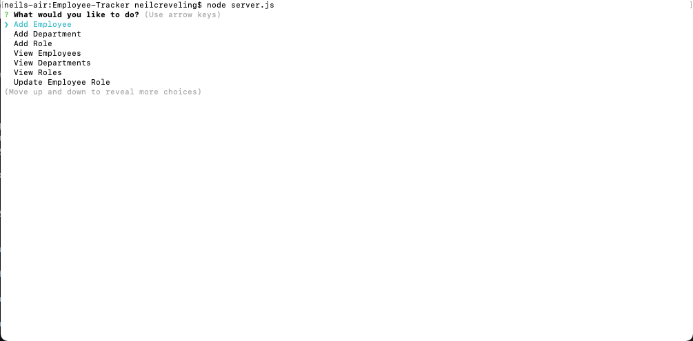
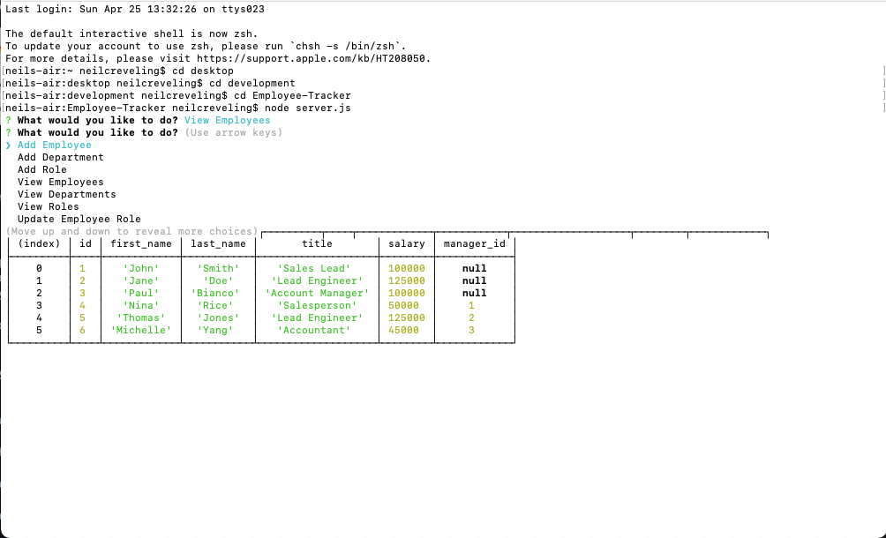
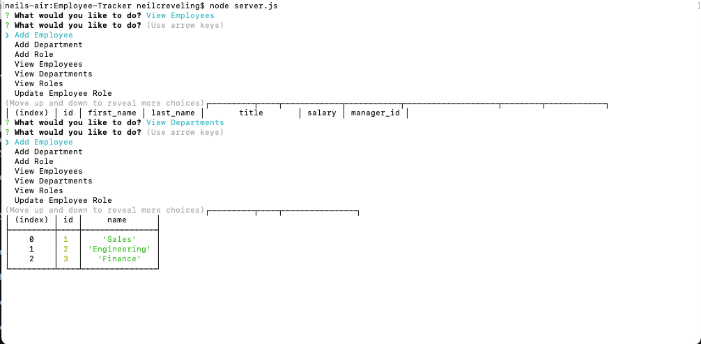
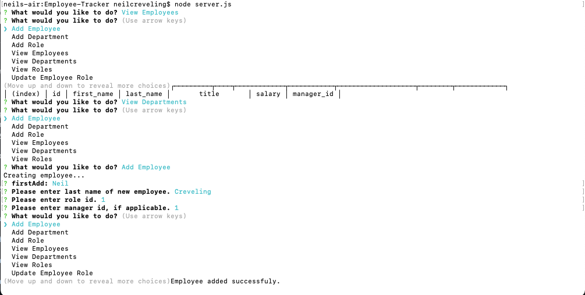
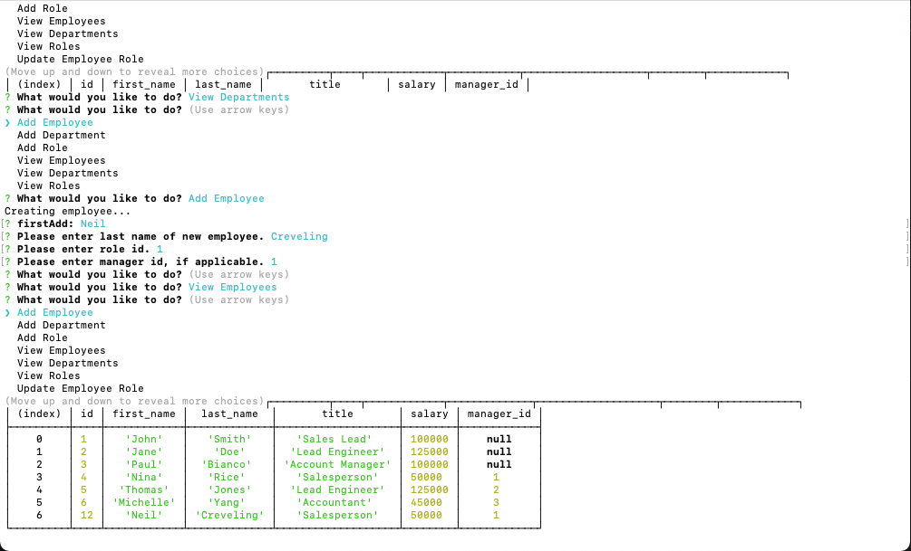
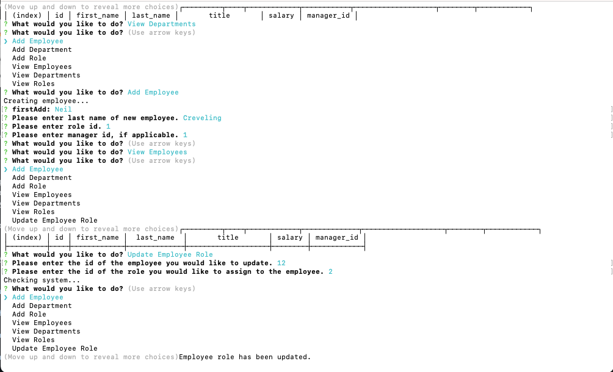
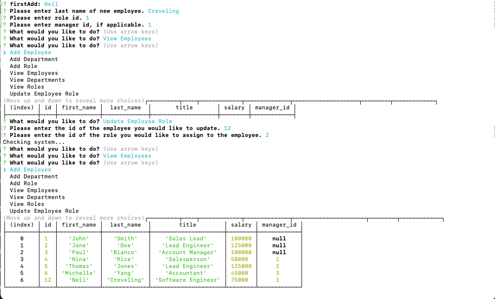
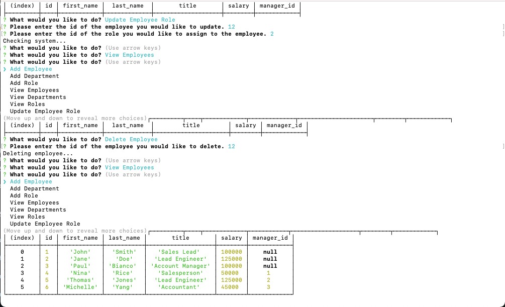

# Employee-Tracker
A Content Management System (CMS) for managing a company's employees.

## About

This application acts as solution for managing a company's employees. Currently, the app is capable of adding, viewing, and deleting employees, employee roles, and departments within the company. The user can also update an employee's role within the company. Created using node, Inquirer, and Mysql, this simple application can solve the basic needs of a business owner.

## Application

This application is run completely through the command-line.

Features include:

* A CMS system structured around employees, departments, roles, and managers.
* The ability to add employees, roles, and departments.
* The ability to view all all employees, roles, and departments.
* The ability to update an employee's role.
* The ability to delete employees, departments, and roles.

Below, there is a video walkthrough of the functionality of the application. There are also screenshots of the final terminal result, and the final appearence of the sample README.md in its entirety.

[Walkthrough Link](https://www.youtube.com/watch?v=-uy6esQlePs&t=4s)

## License

MIT License

Copyright (c) 2021 Neil Creveling

Permission is hereby granted, free of charge, to any person obtaining a copy of this software and associated documentation files (the "Software"), to deal in the Software without restriction, including without limitation the rights to use, copy, modify, merge, publish, distribute, sublicense, and/or sell copies of the Software, and to permit persons to whom the Software is furnished to do so, subject to the following conditions:

The above copyright notice and this permission notice shall be included in all copies or substantial portions of the Software.

THE SOFTWARE IS PROVIDED "AS IS", WITHOUT WARRANTY OF ANY KIND, EXPRESS OR IMPLIED, INCLUDING BUT NOT LIMITED TO THE WARRANTIES OF MERCHANTABILITY, FITNESS FOR A PARTICULAR PURPOSE AND NONINFRINGEMENT. IN NO EVENT SHALL THE AUTHORS OR COPYRIGHT HOLDERS BE LIABLE FOR ANY CLAIM, DAMAGES OR OTHER LIABILITY, WHETHER IN AN ACTION OF CONTRACT, TORT OR OTHERWISE, ARISING FROM, OUT OF OR IN CONNECTION WITH THE SOFTWARE OR THE USE OR OTHER DEALINGS IN THE SOFTWARE.
